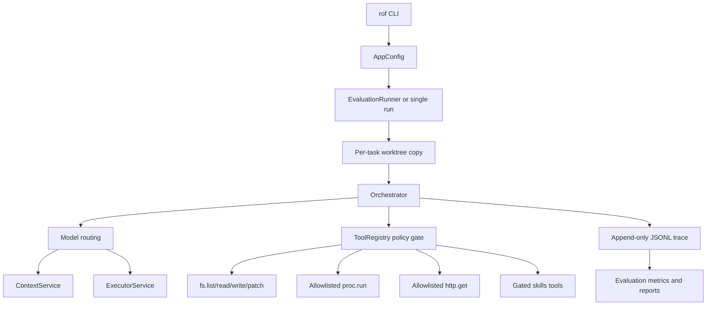
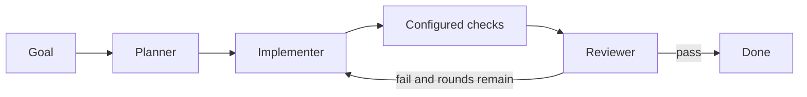

# ROF Harness Architecture

Last updated: 2026-09-16

## Purpose

ROF is a local Rust harness for running bounded coding agents against a working tree. The harness owns orchestration, context construction, tool authorization, filesystem isolation, tracing, and evaluation. Only model inference leaves the local process.

The design has two goals:

- Make agent side effects explicit, gated, bounded, and observable.
- Measure task outcomes independently from model verdicts, tool activity, context cost, and latency.

The repository is one Rust crate. The main runtime is the `rof` binary and the public implementation is under `src/`.

## System Shape



## Runtime Components

### CLI and configuration

`src/main.rs` loads defaults, an optional JSON config, environment overrides, and CLI overrides. The effective configuration can be emitted as canonical JSON with `rof config`.

Important controls include:

- `ROF_MODE=pipeline|direct`: orchestration mode. `pipeline` is the default; `direct` is an opt-in experiment.
- `ROF_PLANNER=always|skip`: whether a goal is decomposed into plan tasks.
- `ROF_MAX_ROUNDS`: retry bound for a task.
- `ROF_MAX_TASK_TOKENS`: per-task model token ceiling.
- `ROF_ALLOW_CMDS` and `ROF_ALLOW_HOSTS`: exact command and host allowlists.
- `ROF_WORKDIR`: source tree used as the task input.
- `ROF_TASK_ROOT`: location for isolated task copies.
- `ROF_TRACE`: append-only trace destination.

Configuration precedence is defaults, JSON config, environment, then CLI flags.

### Orchestrator

`src/engine/orchestrator.rs` owns the task loop and is the main control boundary. It:

1. Builds retrieved and layered context.
2. Routes work to the Context or Executor service.
3. Invokes agent roles.
4. Applies artifacts only through `ToolRegistry`.
5. Runs configured checks.
6. Feeds failures and file-state evidence into retries.
7. Emits state transitions, model calls, tool calls, and verdicts.
8. Returns a structured task result consumed by the evaluator.

The orchestrator, rather than an agent, decides whether a task passed. In particular, an expected-write task cannot pass when no write landed, regardless of the model's verdict.

## Orchestration Modes

### Pipeline mode

The default path is:



- The Context LLM plans the goal and may summarize context.
- The Executor LLM implements each plan task.
- The harness runs configured checks before review.
- The reviewer receives the artifact, write counts, check output, and independently read-back content for touched files.
- The reviewer is read-only. A reviewer pass is still subject to the harness-side write gate.

Pipeline mode is useful for broad or ambiguous goals, and for independent verification. Its measured weakness is role overhead and model-side self-review: on the current KDL issue arm it completed `0/3` tasks.

### Direct mode

Direct mode is an uncommitted, opt-in path for task-shaped coding goals:


- It skips planner and reviewer model calls.
- One executor performs reads, patches, and writes through the same tool gate.
- Every configured check runs after an attempt.
- Failed checks and current touched-file evidence are included in retry context.
- The harness still requires a real write when `expect_writes` is true.

The current evidence favors direct mode for narrow coding goals but is not yet conclusive: a matched three-run KDL arm completed `1/3`, versus `0/3` for the planner-skipped pipeline arm. The direct result is variable and should not yet become the default.

Recommended direction: direct executor plus mandatory harness checks, with independent reviewer verification retained as an optional second pass rather than forcing planner-reviewer overhead onto every task.

## Agent Roles

All roles implement the `Agent` trait in `src/agents/` and receive an `AgentCtx` containing a prepared context view, model services where permitted, tool registry access where permitted, workdir information, and the trace sink.

### Planner

The planner receives the goal, retrieved context, long-term conventions, and optionally skill information. It returns task strings and acceptance information. Planner execution can be skipped for already task-shaped goals.

### Implementer

The implementer receives repository file maps and retrieved context. Its JSON artifact may contain:

- `reads`: bounded requests for files needed to establish facts.
- `patches`: one search/replace hunk per edit.
- `writes`: new or substantially rewritten files.
- `skills` and `skill_views`: gated procedural-memory operations.

The harness applies patches and writes through `fs.patch` and `fs.write`, records success or refusal, and reads touched files back for retry evidence.

### Reviewer

The reviewer returns `{pass, feedback}`. It cannot write. Before the verdict, the harness supplies:

- the implementer artifact,
- expected-write and actual-write counts,
- explicit configured-check status and condensed output,
- independently gated `[VERIFIED FILES]` content for touched paths,
- skill changes and relevant task context.

This keeps the reviewer from treating prose or a passing check on an unchanged tree as completion.

## Context System

`src/context/` manages three prompt layers:

- **Long term:** stable conventions and skill index; normally kept as a cacheable prefix.
- **Mid term:** goal, retrieval results, plan/task context, and relevant file content.
- **Short term:** round markers, artifacts, checks, refusals, and retry feedback.

`ContextPolicy` assigns budgets and strategies per layer. `ContextBuilder::plan_summarized` summarizes an armed layer before truncation and caches summaries by layer content. The default policy keeps long and short layers unarmed and permits mid-layer summarization at its configured threshold.

Keyword retrieval is deliberately dependency-free. It ranks files and returns bounded excerpts; it does not claim semantic understanding. Context metrics record retrieved size, referenced size, summaries, and truncations.

## Tool and Security Boundary

`ToolRegistry::call` is the only path from an agent to a side effect. Authorization checks both:

1. The `(agent, tool)` grant matrix.
2. Path or command policy for the requested operation.

Current tools:

- `fs.list`, `fs.read`: bounded repository reads.
- `fs.write`: bounded overwrite/create under the workdir.
- `fs.patch`: unique exact or whitespace-tolerant search/replace; ambiguous or missing matches are refused.
- `proc.run`: exact command-string allowlist, no shell, bounded output and timeout.
- `http.get`: exact host allowlist, HTTP(S) only, no redirects, bounded body.
- `skills.list`, `skills.view`, `skills.manage`: name-addressed procedural memory with its own policy.

The reviewer has read and check permissions but no write permission. The implementer has write permissions but cannot bypass the skills policy because the skill root is excluded from filesystem allowlists.

Known security follow-up: containment is currently lexical and does not resolve symlinks. A symlink inside an allowed directory can therefore point outside the intended root. This must be fixed before trusting write-enabled runs against untrusted trees.

## Skills and Procedural Memory

Skills live as `~/.rof/skills/<name>/SKILL.md` with optional support files. The harness exposes progressive disclosure:

- An index of names and descriptions is injected into permitted agent prompts.
- Bodies are fetched only when the goal names a skill or the model requests one.
- Manage operations default to proposals requiring human approval.

The skill store is separate from ordinary filesystem tools so an implementer cannot silently rewrite the instructions that govern it.

## Evaluation and Observability

`src/eval/` runs JSON suites. Each task receives an isolated copy of the workdir, its own trace fork, and its own result. Parallel tasks do not share mutable trees.

A task result is matched against `expect_pass`; it is not counted from reviewer verdicts. Aggregate metrics keep these dimensions separate:

- task count and task pass count,
- reviewer verdict count and passed verdict count,
- tool calls and successful tool calls,
- model tokens, cache hits, latency, retries, and estimated cost,
- retrieval relevance proxy,
- context summaries and truncations,
- skill operations and budget aborts.

Reports carry input labels including git head, config hash, suite hash, models, and harness version. `rof compare` refuses to imply a treatment effect when the task or configuration sets differ.

## Trace Events

`src/obs/trace.rs` writes append-only JSONL events for:

- session and state transitions,
- model calls and model errors,
- tool calls,
- review verdicts,
- budget aborts,
- context summaries and truncations,
- skill operations,
- goal-quality checks and auto-pokes.

The trace is the durable explanation for a report. A report says what happened; the trace is where the sequence and evidence can be inspected.

## Current Design Decisions

- Keep the system as one local Rust crate.
- Keep the tool gate centralized and deny by default.
- Prefer explicit structured reports and traces over model prose as evaluation evidence.
- Treat `expect_writes` as a task contract, not an inferred truth.
- Use direct execution for narrow goals only after preserving mandatory checks and write gates.
- Keep planner and independent reviewer capabilities for broad goals and verification.
- Treat live arms as experiments: freeze the tree, keep task/config/model inputs constant, use at least three repetitions, and inspect matched task outcomes.

## Open Work, In Priority Order

1. Improve verification before writes so an executor must establish the relevant code facts before proposing an edit.
2. Run a larger frozen direct-versus-pipeline arm before changing the default mode.
3. Convert stringly `writes` results into structured success/refusal records and share the patch/write application loop.
4. Fix symlink-aware containment in filesystem tools.
5. Add independent second-model review only if repeated arms show it changes outcomes enough to justify the cost.
6. Implement Stage 3 programmable persistent state after execution reliability is established.

## Verification Commands

```bash
cargo test --all-targets
cargo clippy --all-targets -- -D warnings
cargo fmt --check

ROF_WORKDIR=/path/to/scratch \
ROF_MODE=direct \
ROF_MAX_ROUNDS=3 \
ROF_ARM_DIR=/tmp/rof-runs-direct \
scripts/measure-arm.sh direct 3 /path/to/suite.json --jobs 1
```

Live runs must use a scratch worktree. They can edit task copies and build large per-task `target/` directories; remove those copies after inspection.
